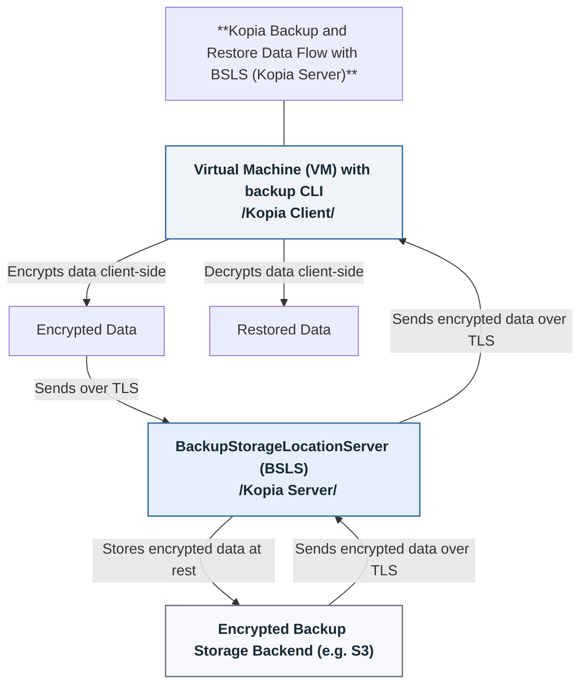

# BackupStorageLocationServer (BSLS) Design

## Abstract

The BackupStorageLocationServer (BSLS) is a Kubernetes Custom Resource designed to provide and manage backup repository servers as a managed service within the cluster.

BSLS acts as an abstraction layer that leverages underlying BackupStorageLocationRepository (BSLR) resources, exposing repository services to cluster users without revealing the actual backup storage details such as S3 credentials or S3 bucket names.

By doing so, BSLS enables users to perform self-service, path-level backups and restores via a Kubernetes-native, client-server architecture. This approach decouples repository management from direct access to the storage backend, enhancing security and simplifying user interactions.

One of the examples where such design would be especially valuable is in OpenShift Virtualization environments. In these scenarios, virtual machine (VM) users often need to back up or restore specific folders or files inside their VMs without having access to the underlying storage or requiring cluster-admin privileges. BSLS enables these VM users to securely interact with backup services through a standardized interface, allowing them to manage data protection for their workloads in a self-service and controlled manner.

## Background

Traditional OADP VM backup and restore workflows focus on block-level consistency by snapshotting entire storage volumes.

While this approach is effective for full system recovery, it can be inefficient and cumbersome when operators or application owners need to back up user-specific data or restore individual files and directories. The BackupStorageLocationServer (BSLS) addresses this limitation by providing a persistent, long-running service that decouples file-level backup operations from volume snapshot management. This separation enables more flexible and efficient file-level backup and restore processes within the OpenShift Virtualization ecosystem.

BSLS operates as a secure proxy between users and the underlying backup repository. File-level backup data is encrypted on the VM using Kopia’s client-side encryption, and then securely transmitted over TLS to a centrally managed Kopia server. The server writes encrypted data to the storage backend, ensuring that all data remains encrypted at rest. 

BSLS itself remains stateless with respect to user data. It does not persist sensitive content, but instead facilitates secure, authenticated access to the repository through standardized Kopia APIs. This design ensures end-to-end protection—from data generation inside the VM to encrypted storage in the backend—while preserving strong separation of concerns. BSLS handles orchestration and access control, while the storage backend enforces durability, encryption, and data integrity.

## Scope

This design focuses on the `BackupStorageLocationServer` (BSLS) Custom Resource Definition (CRD) as the primary proxy that enables users and clients to securely access and utilize the Kopia backup repository, which is defined and configured via the `BackupStorageLocationRepository` (BSLR) CRD.
 - BSLS acts as a repository server, proxying all access to the underlying Kopia repository managed by the BSLR.
 - BSLS handles user authentication, authorization, and access control, providing username/password-based access without exposing repository storage credentials to clients.
 - Repository-level access and configuration, including credentials, storage backend, and repository parameters, are managed by the BSLR.
 - BSLS enforces per-user isolation of snapshots and policy manifests, ensuring users see only their own backups and configurations.
 - The BSLS communicates with Kopia clients over TLS-encrypted connections, ensuring secure data transmission.
 - Access control lists (ACLs) and permissions are managed by BSLS, limiting user capabilities based on predefined rules and preventing unauthorized data modification or access.
 - This design assumes that the BSLS is deployed within the OpenShift cluster or in a network environment that provides VMs running Kopia clients with low-latency, high-bandwidth internal access, ensuring efficient and secure backup and restore operations.

## Goals

* **Provide a managed backup repository service**: Enable OpenShift users to perform file-level backups and restores through a persistent, long-running service without needing direct access to underlying storage details.  
* **Abstract repository management**: Decouple repository access, user credentials, and permission management from raw backup storage by centralizing these concerns in the BSLS.  
* **Zero-trust security model**: Implement a zero-trust security model where each user accesses the repository with distinct, securely managed credentials (e.g., stored as OpenShift Secrets) to enforce strict access control and minimize trust assumptions.  
* **Self-Service for Users**: Enable users to use a standard client to back up and restore their own files on their own schedule.  
* **Centralized User Management**: Manage user credentials via Kubernetes `Secrets` or `ConfigMaps`, allowing for GitOps-style management and easy user rotation.  
* **Secure by Default**: Ensure all communication between the client and the server is encrypted using TLS, and that all backup data is encrypted on the client side before transmission to maintain end-to-end data confidentiality.  

## Non-Goals

* **Replacing Existing Backup Solutions**: This is a complementary solution for file-level backup, not a replacement for full snapshot capabilities.  
* **Automatic Backup Client Installation**: The installation and configuration of the client inside the guest OS is the responsibility of the user.  
* **External File Access**: This design does not use external mechanisms to access the VM from the outside. All connections are initiated by the client inside the VM.  
* **Application Consistency**: It is the responsibility of the user to ensure that the application’s data is in a consistent state before starting a backup.
* **ACL Support**: The initial implementation does not support configuring granular Kopia Server ACLs. All users will operate under the default access model. Fine-grained ACL configuration may be introduced in a future enhancement.

## High-Level Design

The BSLS is a persistent server component deployed in the OpenShift cluster that proxies secure access to a shared Kopia repository.

The BSLS acts as a secure proxy, enabling users to connect to it via Kopia-compatible clients with per user individual credentials. These credentials are provisioned and managed as OpenShift `Secrets` and are synced to the Kopia repository by the BSLS controller to enforce user-level access control.

The repository itself is defined in a separate `BackupStorageLocationRepository` (BSLR) custom resource and updated by the OADP BSLR controller. This decouples backend storage management from user access, allowing the BSLS to serve users securely without exposing storage credentials or infrastructure details.

## Detailed Design

### BSLS Overview

* **Pointer to Repository**:  
  Each `BackupStorageLocationServer` (BSLS) instance points to a single repository specified by a `BackupStorageLocationRepository` (BSLR) resource, which must be in a ready state for the BSLS to operate.

* **Credential Management**:
  * **User Access**:  
    - User credentials (username/password) for accessing the BSLS are stored as OpenShift `Secrets`. These are managed by the BSLS controller and are used by Kopia clients running inside VMs.
    - One BSLS can be shared between multiple users. These users cannot see each other’s snapshots, policies, or data. Access is isolated per user through Kopia’s access control mechanisms.

  * **Repository Access**:
    Credentials required by the BSLS to open and manage the Kopia repository are also stored as OpenShift `Secrets` and referenced in the OADP `DataProtectionApplication` (DPA) or `BSLR` CRDs. The BSLS uses these to authenticate to the backend storage securely. 
* **Configuration**: 
  - BSLS does not contain Kopia specific configuration parameters such as encryption algorithms, compression settings, and other repository-specific options, those are managed by the BSLR or DPA.
  

### BSLS Controller Responsibilities

The BSLS controller is responsible for managing the lifecycle and configuration of the `BackupStorageLocationServer` resource and ensuring secure, multi-user access to the underlying Kopia repository.

Key responsibilities include:

 * **Repository Connectivity**: Ensure the associated `BackupStorageLocationRepository` (BSLR) is available and ready before exposing the server to users.

  * **TLS and Network Security**: Configure TLS certificates for encrypted client-server communication. Ensure secure exposure of the Kopia API within the cluster network.

 * **User Provisioning**: Reconcile Secrets or ConfigMaps containing user credentials and sync them to the Kopia repository to create or update user accounts.
 

### Reconciliation Flow

When a BackupStorageLocationServer (BSLS) resource is created or modified, the controller takes the following steps:

 1. **Validation**
   * Verify that the spec.LocationRepository field references a valid and Ready BackupStorageLocationRepository (BSLR) in the same namespace.
   * If invalid, mark the BSLS as NotReady and Requeue.
 2. **TLS Setup**
   * Generate new or use a TLS certificate(s) from mounted from the OpenShift Secret for the BSLS service.
   * Record the certificate's SHA256 fingerprint in the BSLS .status.tlsFingerprint field for client verification.
   * The BackupStorageLocationServer Certificate's SHA256 fingerprint is required for the client to connect.
 3. **Deployment/Service Management**
   * Deploy or modify already existing Kopia Server Pod with appropriate Configuration.
   * Expose the server internally via OpenShift Service.
 4. **User Secret Synchronization**
   * Reconcile each credential into the Kopia repository using the Kopia server’s user management API.
   * Watch for referenced OpenShift Secrets (user credentials) and re-run Kopia repository credential update logic.
 5. **Change Handling**
   * If the BSLR is modified (e.g., storage config updated), the BSLS is Reconciled.

## Example: KubeVirt Implementation

In the context of KubeVirt, the BSLS can be used to manage backups for virtual machines running within the cluster. Users within a KubeVirt VM can use a standard Kopia compatible client to back up and restore their own files on their own schedule, leveraging the BSLS to manage the repository lifecycle and ensure secure, efficient backups.

This generic design can be adapted to various environments and use cases, with KubeVirt serving as a specific example of how the BSLS can be utilized to enhance backup capabilities within a Kubernetes-based virtualization platform.

## Alternatives Considered

* **Direct User Access to Object Storage**
  * Pros
    * Simplifies the architecture by eliminating the need for an intermediary proxy service.
    * Enables users to interact with backup data directly and independently.

  * Cons
    * Introduces significant security risks, such as exposure of sensitive infrastructure details (e.g., bucket names, access keys).
    * Makes it difficult to enforce access control, audit usage, and manage multi-tenancy securely.

* **Sidecar-Based Restore Agents**
    > Note: This design is not ruled out but is outside the scope of the current proposal. It may be implemented as a separate feature focused on file-level restoration from full VM snapshots.

  * Pros
    * Enables consistent, centralized management and auditing of backup and restore operations within the cluster ecosystem.
    * Hides backup operations from the users.
    * Allows access to full snapshot backups and supports selective file injection into the VM.

  * Cons
    * This approach introduces tighter coupling between the VM lifecycle and backup logic, which can increase operational complexity.
    * Restore operations are typically managed by cluster administrators, requiring additional expertise and coordination.
    * Backup and restore operations may be difficult or unsupported for filesystems mounted externally (e.g., NFS, iSCSI), as these volumes are often outside the scope of VM-level snapshots.
    * Each restore sidecar may require elevated privileges, access to backup storage and snapshot APIs, and potentially direct access to the VM from an external context, increasing the attack surface and risk if compromised.
    * Snapshots may capture filesystems in an inconsistent state if not coordinated with the guest OS, making file-level restores less reliable without additional coordination, such as using guest agents.
    * Injecting files back into a VM may require keeping a snapshot mounted or accessing it using virtualization tooling during the restore process, resulting in additional CPU, memory, or I/O overhead.
    * File-level access from full snapshots may require deep integration with specific snapshot formats (such as CSI or KubeVirt volume snapshots) and an understanding of the VM image formats (e.g., QCOW2, RAW, VMDK) as well as guest filesystem types (e.g., NTFS, ext4, XFS).

## Security Considerations

Security is a core pillar of the BSLS design, and several mechanisms are used to protect user data and credentials:

  * **Client-Side Encryption**: All data is encrypted before it leaves the User data (e.g. inside the VM) using Kopia’s client-side encryption. This ensures that even if data in transit or at rest is compromised, it remains unreadable.

  * **TLS Encryption**: Communication between the Kopia client and the BSLS server is encrypted using TLS. The BSLS controller manages TLS certificate issuance.

  * **Credential Separation**: Users never receive or interact with repository backend credentials. Their authentication is limited to per-user credentials stored securely as OpenShift Secrets and scoped only for use with the BSLS service. These credentials are synchronized and stored within the Kopia repository at the backup location itself, ensuring that even if cluster services or secrets are deleted, user credentials remain safe and accessible.

  * **Repository Isolation**: Although a shared repository is used, Kopia's user scoping ensures that snapshots and policies are strictly isolated per user. Users cannot access or list backups that do not belong to them.

## Compatibility

The BSLS is designed to be compatible with the following components and environments:

 * **OpenShift**: It uses standard CRDs, Secrets, Services, and controller patterns within OADP Operator. OpenShift-specific integration (e.g., with the DPA's BSL) is additive but not required.

 * **Kopia Clients**: Any client that supports standard Kopia protocols and TLS communication can interact with BSLS, including CLI and API-based clients inside VMs.

 * **Multi-Tenant Environments**: BSLS is designed to support multiple users within a single repository, making it well-suited for shared infrastructure scenarios such as KubeVirt. Additionally, it can be adapted to create separate BSLS instances for individual VMs if needed.

## Open Issues

The BSLS design introduces new capabilities, but also comes with open questions and areas for further exploration:

 * **Audit Logging**: The current BSLS design does not explicitly define how access and backup events are logged. This could be a compliance gap in regulated environments.

 * **Client TLS Fingerprint Management**: The requirement for clients to validate the TLS certificate fingerprint introduces complexity in dynamic or short-lived VM environments. Automating this bootstrap process would improve usability.

 * **Master Repository Password Management**: The possibility for backup users to create or change repository passwords is not yet addressed.

 * **Integration with Identity and Access Management (IAM)**: Seamless integration with existing IAM systems remains an open area.

 * **Monitoring and Access Audits**: Comprehensive monitoring and auditing capabilities are not currently covered by the design.
