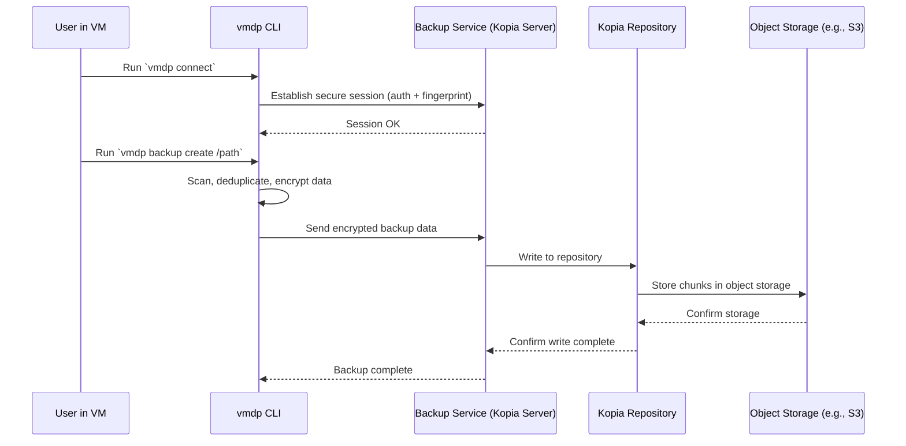
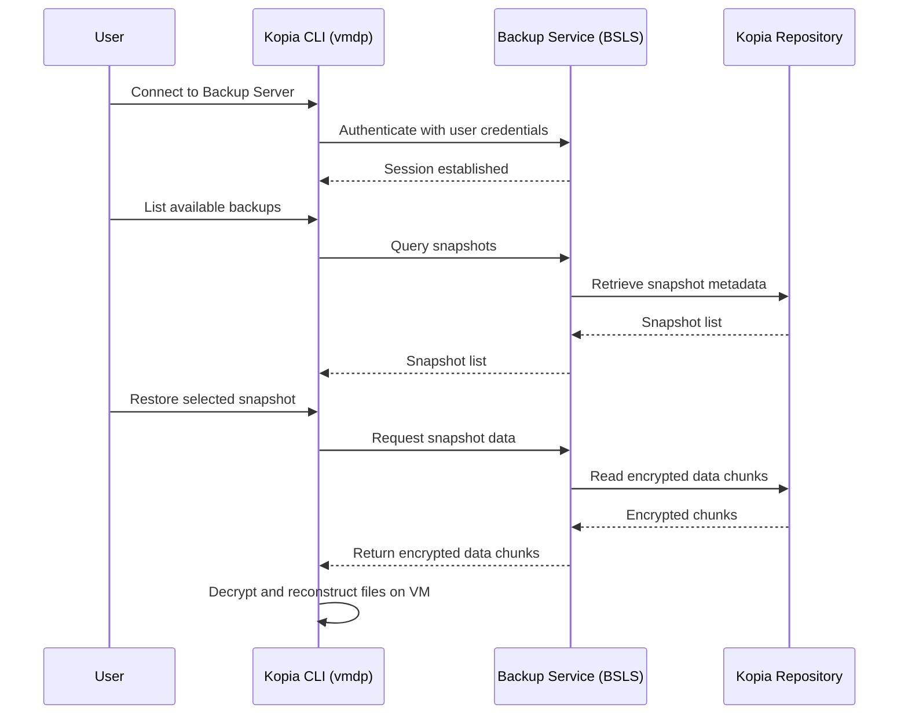

# OADP Virtual Machine Data Protection (VMDP): A Design for User-Driven, File-Level Backups

## Abstract

The OpenShift API for Data Protection (OADP) delivers comprehensive, snapshot-based backup and restore capabilities for OpenShift Virtual Machines (VMs), providing a reliable solution for full disaster recovery scenarios. However, current OADP functionality does not extend to granular, file-level backup and restore operations initiated from within the guest operating system—such as safeguarding application configurations or user-generated data.

This design introduces a Kubernetes-native, client-server architecture that enables secure, file-level backup and restore directly from within VMs. This approach empowers users with a complementary mechanism to perform targeted backups and recover individual files, including those residing on external network file systems (e.g., NFS) mounted within the guest OS.


## Background

The OpenShift API for Data Protection (OADP) is designed to provide full-system backup and restore for OpenShift Virtual Machines (VMs), with workflows typically managed by cluster or namespace administrators. While this approach is effective for disaster recovery and infrastructure-level protection, it does not natively support granular, file-level backup and restore operations.

In practice, especially in multi-tenant or self-service OpenShift Virtualization environments, VM users and application owners often require the ability to back up or restore specific files and directories—such as application configuration files, logs, or user data. These users generally do not have access to storage backends or the elevated privileges needed for full volume snapshot or restore operations.

To address this limitation, we propose a Kubernetes-native, client-server solution that operates from within the guest OS. This design enables secure, authenticated, and user-driven file-level backup and restore, without exposing sensitive infrastructure details or requiring cluster-level privileges. By complementing OADP’s snapshot-based approach, this new architectural component empowers end users to manage their own data protection needs, bridging the gap between infrastructure-level and application-level protection in OpenShift environments.

## Scope

The scope of the **Virtual Machine Data Protection (VMDP)** feature is to introduce a secure, user-driven mechanism for file-level backup and restore operations originating from within a guest VM. This functionality is intended to complement - NOT to replace - OADP’s existing snapshot-based backup and restore capabilities for full VMs and persistent volumes. Additionally, the new mechanism extends support to file-level operations on network-mounted file systems (e.g., NFS, CIFS) accessible from the guest OS, offering users greater flexibility and control over their data protection needs.

### In Scope

The following components and functionalities are considered within scope for this design and its initial implementation:

- **Core Functionality**: A client-server model that enables backup and restore of specific files and directories from within a guest operating system.
- **User Interaction**: A command-line interface (CLI) available on Linux, macOS, and Windows, allowing VM users to initiate backup and restore operations.
- **Control Plane Integration**: OpenShift-native management using Custom Resource Definitions (CRDs) and controllers to handle and track file-level backup/restore requests.
- **Authentication and Security**: User-specific credentials are provisioned using OpenShift `Secrets` and `ConfigMaps`, and synchronized with the Kopia repository server. These credentials allow the in-guest client to authenticate directly with the Kopia server to perform backup and restore operations.
- **Storage Integration**: Use of OADP’s existing `BackupStorageLocation` (BSL) abstraction to define and manage backup targets.
- **Supported File Systems**: Backup and restore operations on any standard, mounted file system accessible from within the guest OS, including network file systems such as NFS and CIFS.
- **Repository Management**: Support for multiple logical backup repositories within a single namespace, associated with a shared BSL.

### Out of Scope

The following are explicitly out of scope for this project phase:

- **Full VM Protection**: This design does not modify or replace OADP’s snapshot-based backup and restore for entire VMs or persistent volumes.
- **Application Quiescing**: The system will not implement application-level consistency mechanisms (e.g., pausing databases). Ensuring data consistency remains the user's responsibility.
- **Block-Level Operations**: Backup or restore of raw block devices, unmounted partitions, or disk images is not supported.
- **Graphical User Interface (UI)**: No integration with the OpenShift Console or other web-based user interfaces is included.
- **Client Lifecycle Management**: Automated deployment, installation, or upgrading of the in-guest client software is out of scope.
- **External VM Access**: The design does not introduce new mechanisms for cluster-initiated access to guest VMs (e.g., SSH injection, `virt`-based access).
- **New Storage Backends**: This effort does not introduce support for new storage backend types. Only those already supported by OADP will be used.
- **Advanced Observability**: Detailed metrics, dashboards, or alerting features for file-level backup operations are not addressed in this phase.

## Goals

By delivering the features defined in this scope, the VMDP design aims to achieve the following strategic objectives:

- **Empower End Users**: Provide VM users with secure, self-service capabilities to back up and restore their own application data, without needing elevated privileges or administrator intervention.
- **Enhance Data Protection Granularity**: Address a critical gap between infrastructure-level recovery and application-level data needs by supporting fine-grained, file-specific protection.
- **Maintain a Secure, Zero-Trust Model**: Ensure that all client-server interactions are strongly authenticated and authorized using OpenShift-native mechanisms, minimizing risk and privilege exposure.
- **Integrate Seamlessly with OADP**: Leverage existing OADP concepts and APIs (such as `BackupStorageLocation`) to ensure consistent behavior and ease of adoption by administrators.
- **Deliver a Platform-Agnostic Solution**: Support major operating systems commonly used within guest VMs to maximize utility across enterprise environments.

## High-Level Design

The **Virtual Machine Data Protection (VMDP)** feature introduces a OpenShift-native, client-server architecture that enables file-level backup and restore operations initiated from within OpenShift Virtual Machines. The system integrates seamlessly with OpenShift APIs and the existing OADP infrastructure, while preserving a clear separation of responsibilities between cluster administrators and VM users.

### Architecture Overview

The solution consists of the following core components:

1. **In-Guest Backup Client**  
   A lightweight, statically linked Go-based CLI tool, built from the standard Kopia CLI source code and fully compatible with Kopia APIs. It is designed to run entirely in user space (without requiring elevated privileges) and can be easily downloaded and executed—even outside standard installation paths. This client allows users to perform file-level backup and restore operations from within the guest VM, authenticating with the Kopia server using user-specific credentials.

2. **Backup Service (Kopia Server)**  
   A multi-user backup repository server deployed within the OpenShift cluster. It handles file uploads, downloads, metadata management, and repository access via authenticated client connections. The server uses per-user credentials, provisioned and synchronized from OpenShift `Secrets` and `ConfigMaps`, to authorize operations.

   Multiple Backup Services can be deployed per each BackupStorageLocation (BSL), offering flexibility in deployment strategies. It is up to the cluster administrator to decide whether to share a single Backup Service instance among multiple users and VMs or to provision a dedicated instance per VM. Both approaches are secure: shared services rely on strong user isolation and credential scoping within the Kopia server, while per-VM deployments offer additional isolation where needed. This flexibility allows administrators to tailor deployments to different performance, tenancy, or security requirements.

3. **Custom Resource Definitions (CRDs) and Controller**  
   This component extends the existing OADP operator by adding a new controller and introducing two new CRDs:

   - **BackupStorageLocationServer (BSLS)** — represents the deployment and configuration of a Kopia Backup Service instance within the OpenShift cluster. The BSLS points either directly to a Velero `BackupRepository` or to a new CRD `BackupStorageLocationRepository`.

   - **BackupStorageLocationRepository (BSLR)** — represents the Kopia repository backing the file-level backups for a given Backup Storage Location. The BSLR points back to a `BackupStorageLocation` (BSL). The BSLR concept is similar to a Kopia BackupRepository but is managed by OADP.

   This design separates the management of backup repositories from the storage locations themselves, making it easy to map Kopia repositories to OpenShift BackupStorageLocations in a flexible way. Administrators can control exactly how repositories are created, assigned, and managed for each user or VM. By building on top of the existing OADP operator and using familiar resources like `BackupStorageLocation` (BSL), the system fits naturally into OpenShift’s data protection workflows. This approach makes it straightforward to perform detailed, file-level backup and restore operations, while keeping the process consistent and easy to understand.

4. **Repository Provisioning & Management**  
   Logical backup repositories are created and scoped per user, per VM, or shared among multiple users and VMs. These repositories are linked to existing `BackupStorageLocation` (BSL) definitions to leverage OADP-supported storage backends such as S3, GCS, or Azure Blob.

   - A **Velero Backup Repository (BR)** stores its metadata (e.g., snapshots, indexes) directly within the backup storage backend (e.g., an S3 bucket). This means the repository metadata is part of the stored content and can be automatically synchronized or recovered when a new `BackupStorageLocation` (BSL) points to the same storage location.

   - In contrast, a **BackupStorageLocationRepository (BSLR)** is a OpenShift-managed resource that represents a Kopia repository with metadata managed primarily inside OpenShift (via the CRD). The BSLR’s metadata is **not stored in the backup storage backend** (e.g., S3). As a result, repository metadata for BSLRs is **not automatically synced or restored** when creating or switching to a new BSL pointing to the same storage location.

The key difference between a Velero Backup Repository (BR) and a BackupStorageLocationRepository (BSLR) lies in where their metadata is managed. BR stores repository metadata directly in the backup storage backend (e.g., S3), enabling automatic synchronization and recovery by simply reusing the storage location. In contrast, BSLR manages metadata within OpenShift via Kubernetes CRDs, decoupling it from the storage backend. This design provides more explicit control over repository provisioning, lifecycle, and security.

5. **Credential Management**  
There are three distinct types of credentials involved in the system:

   - **Repository Credentials:** These are the passwords required to open and operate a specific Kopia repository. They are securely stored as OpenShift `Secrets` and are associated with either a *Velero Backup Repository (BR)* or a *BackupStorageLocationRepository (BSLR)*. Possession of these credentials enables clients to unlock and access the repository’s metadata and content.

   - **Storage Backend Credentials:** Credentials (e.g., S3 access keys) required by Kopia to access the object storage where the repository resides. These are associated with the *BackupStorageLocation (BSL)* and are needed for repository creation and operation. They are not exposed to end-users, as the Kopia Server (BSLS) acts as a secure proxy, handling storage access internally.

   - **User Access Credentials:** These credentials are linked to the *BackupStorageLocationServer (BSLS)* and represent user-specific accounts on the Kopia server. They authenticate users connecting to the Kopia service (BSLS service), enforcing isolation and access control so users can only access their data.

   These credentials are not stored within the Kopia Repository but are kept separately as the OpenShift Secrets that are used by the Backup Server process.

   In addition to credentials, clients verify the identity of the Backup Service using the server’s certificate fingerprint, ensuring secure and trusted communication.

   Kopia’s design separates repository encryption and authentication from user access control. The repository credentials decrypt and unlock the data storage, while user credentials regulate who can connect and perform operations on the Kopia server. This layered credential model enhances security by isolating repository-level secrets from user-level authentication, enabling fine-grained, multi-tenant access management within OpenShift.

   By maintaining this distinction, the system enables flexible deployment models: administrators can choose to share a single repository among multiple VMs and users—relying on user-level isolation within the Kopia server—or to provision dedicated repositories for each VM to maximize isolation. In all scenarios, repository credentials safeguard access to encrypted backup data, while user credentials govern authenticated interactions with the Backup Service. This approach ensures that multi-tenant security requirements are met, regardless of the chosen deployment strategy.

   The following diagram illustrates how the proposed design leverages OpenShift secrets to securely unlock the backup repository, authenticate users, access storage, and serve backup clients.

   ```mermaid
   flowchart TD
      subgraph OpenShift_Secrets
         secretRepo["Kopia Repo Password
                     - Used to Open Repository
                     / Referenced in BR or BSLR /"]
         secretStorage["Storage Credentials (e.g. S3 keys) 
                        - Used to authenticate against storage provider
                        / Referenced in BSL /"]
         secretUsers["Server User Credentials
                        / Referenced in BSLS /"]
      end

      subgraph Kopia_Repository["Kopia Repository in Object Storage (e.g. S3)"]
         repoData["Encrypted Backup Data & Metadata"]
      end

      subgraph Kopia_Server["Backup Server (BSLS)"]
         kopiaService["Kopia Server Process Uses
                        - Kopia Repo Password
                        - Storage Credentials
                        - Server User Credentials
                        - TLS Authentication"]
      end

      subgraph VM_Client["VM Backup User"]
         vmUser["Connects with: 
                  Username, Password,
                  Repository Password,
                  TLS Fingerprint"]
      end

      %% Secrets injected into Kopia Server
      secretRepo --> kopiaService
      secretStorage --> kopiaService
      secretUsers --> kopiaService

      %% Kopia Server accesses repository in Object Storage
      kopiaService --> repoData

      %% User authentication happens locally on Kopia Server using Secrets
      vmUser --> kopiaService
   ```

### Backup and Restore Workflow Summary

#### Prerequisites

- Internal OpenShift networking must allow VMs to connect to the Backup Service deployed in the OADP namespace.
- A Kopia API-compatible CLI client must be present in the VM. In this design, we refer to this client as `vmdp`. It is fully compatible with the standard `kopia` CLI, but offers a simplified user experience by redefining certain subcommands.
- The user must have valid credentials:
  - Backup Server certificate fingerprint
  - Repository Credentials
  - User Access Credentials

#### Backup Flow

1. **Connect to the Backup Server**  
   The user uses the Kopia compatible CLI inside the VM to connect to the Kopia server (Backup Service) running in the cluster. This step establishes a trusted session and configures the local Kopia client to communicate with the remote repository.

2. **Perform Backup**  
   Once connected, the user initiates a backup by running the `vmdp backup create /path/to/backup` command (or similar), specifying the files or directories to back up. Kopia scans the specified paths, deduplicates data, encrypts it, and uploads the backup to the repository via the backup server. The backup operation can be repeated as needed, and incremental backups are supported by default. All the encryption of files and folders happens on the client side inside the VM.

3. **Session Persistence**
   The connection and authentication information is typically cached locally (e.g., in the user's Kopia config directory), so future backup or restore operations do not require re-authentication unless the session is reset, credentials change or config files deleted.

This flow reflects the standard way Kopia performs backups using its client-server model: connect to the repository, then create snapshots (backups) of desired data.



#### Restore Flow

1. **Connect to the Backup Server**  
   The user uses the Kopia compatible CLI inside the VM to connect to the Kopia server (Backup Service) running in the cluster, just as in the backup flow. This establishes a secure session and allows the local Kopia client to access the remote repository containing the backups.

2. **List and Select Snapshots**  
   After connecting, the user lists available backups (Kopia snapshots) in the repository using commands such as `vmdp backup list`. The user identifies the desired backup(s) to restore based on timestamp, path, or other metadata.

3. **Perform Restore**  
   The user starts the restore process by running a command such as `vmdp backup restore /path/to/backup` inside the VM. This command tells Kopia to retrieve and decrypt the selected backup data from the repository through the backup server. Kopia then reconstructs the original files and directories at the specified restore location within the VM. Users can choose to restore from different backup snapshots and can specify alternative target directories to avoid overwriting existing files during restore.

4. **Session Persistence**  
   As with backup operations, the connection and authentication information is typically cached locally, so repeated restore operations do not require re-authentication unless the session is reset, credentials change, or config files are deleted.

This flow reflects the standard way Kopia performs restores using its client-server model: connect to the repository, then restore data from the selected backup snapshots.




## BackupStorageLocationServer (BSLS) Design and Reconciliation

### BackupStorageLocationServer Overview

The BackupStorageLocationServer (BSLS) is a Kubernetes Custom Resource that manages Kopia backup servers within the cluster, serving as a secure gateway between virtual machine (VM) users and the Kopia repository. 

BSLS itself does not handle encryption; instead, encryption is performed client-side within each VM using Kopia’s client tools. Encrypted data is then transmitted securely over TLS to the Kopia server managed by BSLS. This approach ensures that all backup data remains encrypted in transit and at rest on the repository server.

The BSLS controller is responsible for deploying and maintaining the Kopia server instance, configuring TLS certificates for secure communication, managing user credentials via Kubernetes Secrets, and ensuring the Kopia repository is accessible and properly synchronized with client credentials. By continuously reconciling the BSLS resource, the controller keeps the Kopia server deployment and its configuration aligned with the desired state, enabling reliable and secure backup operations.

### Reconciliation Overview

The BSLS controller continuously reconciles the BSLS resource to maintain its desired state by:

1. **Validation**  
   Confirm that the referenced BackupStorageLocationRepository (BSLR) or Velero BackupRepository (BR) exists and is available to be used before proceeding.

2. **TLS Certificate Management**  
   Generate or update TLS certificates to secure communication between Kopia clients and the server.

3. **Kopia Server Deployment**  
   Create or update the Kopia server Pod and associated Kubernetes resources to ensure the server is running and accessible.

4. **Credential Synchronization**  
   Sync user credentials stored as Kubernetes Secrets to the Kopia server, enabling authenticated access for VM users.

5. **Configuration Updates**  
   Detect changes in the BSLS or BSLR resources and apply updates to the Kopia server configuration accordingly.

Through these reconciliation steps, the BSLS controller ensures the Kopia server is securely configured, operational, and aligned with cluster resource definitions.

### BackupStorageLocationServer CRD

The **BackupStorageLocationServer (BSLS)** custom resource defines a Kopia proxy server instance in OpenShift. It acts as an intermediary between clients (e.g., VMs) and the underlying Kopia repository stored on object storage (e.g., S3).


#### Purpose

- Proxy access to the Kopia repository.
- Manage user authentication and authorization.
- Handle repository unlocking using repository credentials.
- Provide TLS-secured communication.

#### Spec Fields

| Field                        | Type        | Description                                                                                         |
|------------------------------|-------------|-------------------------------------------------------------------------------------------------|
| `backupRepositoryRef`             | string (optional) | Reference to the Velero **BackupRepository (BR)** resource. Cannot be used together with `backupStorageLocationRepositoryRef`.   |
| `backupStorageLocationRepositoryRef` | string (optional) | Reference to the **BackupStorageLocationRepository (BSLR)** resource. Cannot be used together with `backupRepositoryRef`.|
| `userSecretRef.name`              | string (optional) | Name of a Secret containing Kopia proxy server user credentials (username/password).             |
| `loadAffinityConfig`              | array of `LoadAffinity` (optional) | Specifies node affinity rules for the Kopia server pods.   |
| `podResources`                   | `PodResources` (optional) | Specifies CPU/memory resource requests and limits for pods launched by the BSLS. |
---

#### Status Fields

| Field              | Type    | Description                                  |
|--------------------|---------|----------------------------------------------|
| `phase`            | string  | Current lifecycle phase, e.g., `Ready`.      |
| `endpoint`         | string  | Network address to reach the Kopia Server.  |
| `tlsFingerprint`   | string  | SHA-256 fingerprint of the server TLS cert. |
| `conditions`       | array   | List of current status conditions/events.   |

---

```yaml
# Example BSLS CRD specification
apiVersion: oadp.openshift.io/v1alpha1
kind: BackupStorageLocationServer
metadata:
  name: vm-backup-server
  namespace: openshift-adp
spec:
  # Reference to Velero BR (mutually exclusive with backupStorageLocationRepositoryRef)
  backupRepositoryRef: my-backup-repo
  # Reference to BSLR (mutually exclusive with backupRepositoryRef)
  backupStorageLocationRepositoryRef: my-bslr
  userSecretRef:                             # kopia server user credentials
    name: kopia-proxy-users
  loadAffinityConfig:                        # optional node affinity rules
    - nodeSelector:
        matchLabels:
          node-role.openshift.io/bsls: "true"
  podResources:                             # optional CPU/memory requests and limits
    requests:
      cpu: "500m"
      memory: "1Gi"
    limits:
      cpu: "1"
      memory: "2Gi"
status:
  phase: Ready
  endpoint: bsls-vm-backup-server.openshift-adp.svc.cluster.local:51515
  tlsFingerprint: sha256:abcd1234ef5678...
  conditions: []
```

#### Management of the User credential secrets within BSLS

To efficiently manage Kopia server users via OpenShift Secrets, structure the Secret so that each key is a username and the corresponding value is the base64-encoded password. This allows the controller to synchronize the user list with the Kopia server by performing three main operations:

- **Add users:** For each username in the Secret but missing on the Kopia server, run  
  `kopia server user add <username> --password <password>`
- **Remove users:** For each username present on the Kopia server but absent from the Secret, run  
  `kopia server user remove <username>`
- **Update passwords:** For usernames present in both places we always run the password update to ensure they are synced with the secret.

This approach simplifies reconciliation by directly mapping Secret keys to Kopia users, making it easy to detect changes by comparing keys and values.

### Example Secret YAML

```yaml
apiVersion: v1
kind: Secret
metadata:
  name: vm-users
  namespace: openshift-adp
type: Opaque
data:
  alice: cGFzc3dvcmQxMjM=       # base64
  bob: c2VjdXJlcGFzcw==
```

## BackupStorageLocationRepository (BSLR) Design and Reconciliation

The **BackupStorageLocationRepository** (BSLR) custom resource defines a backup repository instance associated with a specific Velero BackupStorageLocation. It represents a Kopia-compatible repository stored in object storage and shared across namespaces or components.

This CRD is conceptually similar to Velero’s **BackupRepository** (BR), but it is not auto-generated or synchronized by the presence of a **BackupStorageLocation**. Multiple BSLRs may reference the same BSL, allowing for distinct repository configurations under a common storage target.

#### Purpose

- Define and manage Kopia repositories using existing **BackupStorageLocation**.
- Enable repository initialization and maintenance operations.
- Coordinate repository unlocking and readiness state across the cluster.

#### Spec Fields

| Field                         | Type                     | Description                                                                                  |
|-------------------------------|--------------------------|----------------------------------------------------------------------------------------------|
| `backupStorageLocation`       | string                   | Name of the Velero BackupStorageLocation this repository is linked to. **Required.**         |
| `maintenanceFrequency`        | string                   | How often maintenance tasks (e.g., prune) should be triggered (e.g., `24h`). **Required.**    |
| `repositoryConfig`            | map[string]string        | Optional configuration fields for repository tuning.                                         |
| `credentialsSecretRef.name`  | string                   | Name of the Secret containing the Kopia repository credentials (e.g., repository open password). **Required.** |

---

#### Status Fields

| Field                  | Type     | Description                                                                 |
|------------------------|----------|-----------------------------------------------------------------------------|
| `phase`                | string   | Current lifecycle phase: `New`, `Ready`, or `NotReady`.                     |
| `message`              | string   | Optional explanation if the repository is not ready.                        |
| `lastMaintenanceTime` | string   | Timestamp of the last successful maintenance operation.                     |
| `recentMaintenance`   | array    | Status of recent maintenance attempts, including result, message, and time. |

---

```yaml
# Example BackupStorageLocationRepository (BSLR) CRD specification
apiVersion: oadp.openshift.io/v1alpha1
kind: BackupStorageLocationRepository
metadata:
  name: example-bslr
  namespace: openshift-adp
spec:
  # Name of the Velero BackupStorageLocation this repository is linked to
  # Must be created before BSLR is created and in a state that allows usage.
  backupStorageLocation: user-vms
  # How often maintenance tasks (e.g., prune) should be triggered
  maintenanceFrequency: 24h
  # Optional tuning configuration for the repository
  repositoryConfig:
    compression: "true"
  # Secret containing Kopia repository credentials
  credentialsSecretRef:
    name: vm-kopia-open-password

status:
  # Current lifecycle phase: New, Ready, or NotReady
  phase: Ready
  # Optional explanation if the repository is not ready
  message: ""
  # Timestamp of the last successful maintenance operation
  lastMaintenanceTime: "2025-07-29T12:34:56Z"
  # Status of recent maintenance attempts
  recentMaintenance:
    - result: Success
      message: "Completed successfully"
      timestamp: "2025-07-28T23:00:00Z"
    - result: Failed
      message: "Maintenance skipped due to lock"
      timestamp: "2025-07-27T23:00:00Z"
```

## Alternatives Considered

* **Direct User Access to Object Storage**
  * Pros
    * Simplifies the architecture by eliminating the need for an intermediary proxy service.
    * Enables users to interact with backup data directly and independently.

  * Cons
    * Introduces significant security risks, such as exposure of sensitive infrastructure details (e.g., bucket names, access keys).
    * Makes it difficult to enforce access control, audit usage, and manage multi-tenancy securely.

* **Sidecar-Based Restore Agents**
    > Note: This design is not ruled out but is outside the scope of the current proposal. It may be implemented as a separate feature focused on file-level restoration from full VM snapshots.

  * Pros
    * Enables consistent, centralized management and auditing of backup and restore operations within the cluster ecosystem.
    * Hides backup operations from the users.
    * Allows access to full snapshot backups and supports selective file injection into the VM.

  * Cons
    * This approach introduces tighter coupling between the VM lifecycle and backup logic, which can increase operational complexity.
    * Restore operations are typically managed by cluster administrators, requiring additional expertise and coordination.
    * Backup and restore operations may be difficult or unsupported for filesystems mounted externally (e.g., NFS, iSCSI), as these volumes are often outside the scope of VM-level snapshots.
    * Each restore sidecar may require elevated privileges, access to backup storage and snapshot APIs, and potentially direct access to the VM from an external context, increasing the attack surface and risk if compromised.
    * Snapshots may capture filesystems in an inconsistent state if not coordinated with the guest OS, making file-level restores less reliable without additional coordination, such as using guest agents.
    * Injecting files back into a VM may require keeping a snapshot mounted or accessing it using virtualization tooling during the restore process, resulting in additional CPU, memory, or I/O overhead.
    * File-level access from full snapshots may require deep integration with specific snapshot formats (such as CSI or KubeVirt volume snapshots) and an understanding of the VM image formats (e.g., QCOW2, RAW, VMDK) as well as guest filesystem types (e.g., NTFS, ext4, XFS).


## Security Considerations

Security is a core pillar of the BSLS design, and several mechanisms are used to protect user data and credentials:

  * **Client-Side Encryption**: All data is encrypted before it leaves the User data (e.g. inside the VM) using Kopia’s client-side encryption. This ensures that even if data in transit or at rest is compromised, it remains unreadable.

  * **TLS Encryption**: Communication between the Kopia client and the BSLS server is encrypted using TLS. The BSLS controller manages TLS certificate issuance.

  * **Credential Separation**: Users never receive or interact with repository backend credentials. Their authentication is limited to per-user credentials stored securely as OpenShift Secrets and scoped only for use with the BSLS service. These credentials are synchronized and stored within the Kopia repository at the backup location itself, ensuring that even if cluster services or secrets are deleted, user credentials remain safe and accessible.

  * **Repository Isolation**: Although a shared repository is used, Kopia's user scoping ensures that snapshots and policies are strictly isolated per user. Users cannot access or list backups that do not belong to them.

  * **Network Security**: BSLS services are configured for cluster-internal access by default, with optional external access through controlled ingress points.

## Compatibility

The system is designed to be compatible with the following components and environments:

 * **OpenShift**: It uses standard CRDs, Secrets, Services, and controller patterns within OADP Operator. OpenShift-specific integration (e.g., with the DPA's BSL) is additive but not required.

 * **Kopia Clients**: Any client that supports standard Kopia protocols and TLS communication can interact with BSLS, including CLI and API-based clients inside VMs.

 * **Multi-Tenant Environments**: BSLS is designed to support multiple users within a single repository, making it well-suited for shared infrastructure scenarios such as KubeVirt. Additionally, it can be adapted to create separate BSLS instances for individual VMs if needed.


## Open Issues

The design introduces new capabilities, but also comes with open questions and areas for further exploration:

 * **Audit Logging**: The current BSLS design does not explicitly define how access and backup events are logged. This could be a compliance gap in regulated environments.

 * **Client TLS Fingerprint Management**: The requirement for clients to validate the TLS certificate fingerprint introduces complexity in dynamic or short-lived VM environments. Automating this bootstrap process would improve usability. Secondly there is currently no mechanism in this design to add OpenShift managed certificates which may be a future enhancement to the BSLS CRD.

 * **Master Repository Password Management**: The possibility for backup users to create or change repository passwords is not yet addressed.

 * **Integration with Identity and Access Management (IAM)**: Seamless integration with existing IAM systems remains an open area.

 * **Monitoring and Access Audits**: Comprehensive monitoring and auditing capabilities are not currently covered by the design.
